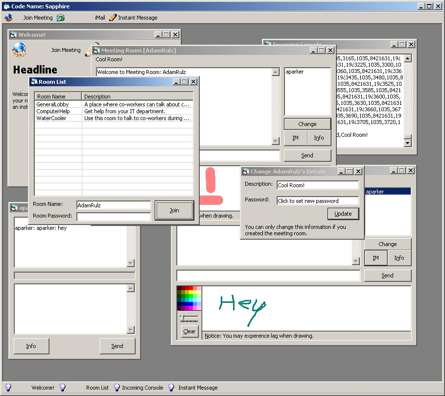



## Shappire: Multi\-User / Multi\-Room Chat w/White Board

### Description

This is a multiple room/user chat program with white board and instant messaging, with mild room permissions and etc. It's incomplete because I got bored with the project. You can take this code and incorporate it into any non-profit program as long as I know about the development and am allowed to follow the progress of the program. All other uses must be approved by myself. If you do not agree with these terms then do not download.
 
### More Info
 

             |
---                |---
**Submitted On**   |2005-04-19 09:50:20
**By**             |[AdamParker](https://github.com/Planet-Source-Code/PSCIndex/blob/master/ByAuthor/adamparker.md)
**Level**          |Intermediate
**User Rating**    |5.0 (15 globes from 3 users)
**Compatibility**  |VB 5\.0, VB 6\.0
**Category**       |[Internet/ HTML](https://github.com/Planet-Source-Code/PSCIndex/blob/master/ByCategory/internet-html__1-34.md)
**World**          |[Visual Basic](https://github.com/Planet-Source-Code/PSCIndex/blob/master/ByWorld/visual-basic.md)
**Archive File**   |[Shappire\_\_1878414192005\.zip](https://github.com/Planet-Source-Code/adamparker-shappire-multi-user-multi-room-chat-w-white-board__1-60092/archive/master.zip)

